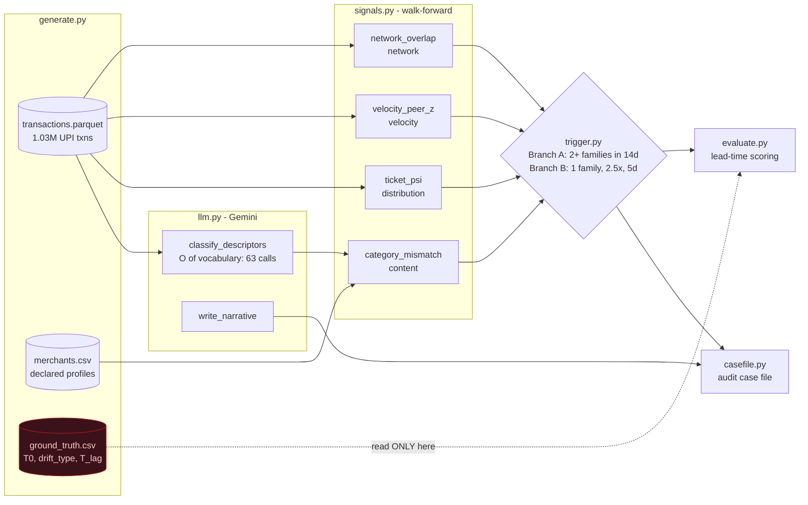

# DriftWatch

**Continuous merchant-drift detection for Indian payment aggregators.**

[](https://github.com/Nithin2511/DriftWatch-Continuous-merchant-drift-detection-for-Indian-payment-aggregators/actions/workflows/ci.yml)


> Razorpay AI Buildathon — Track 02 (AI Risk Manager)

A merchant clears KYC on day 1 and drifts by day 40 — into prohibited categories, into
processing for an undisclosed third party, or into a bust-out. Two clocks are running,
badly mismatched:

| Clock | Duration |
|---|---|
| Time to investigate once a warning signal appears | **72 hours** (Mastercard SMMP, live 24 Jul 2026) |
| Time until confirming evidence arrives (chargebacks, LEA holds) | **30–90 days** |

A system that waits for chargebacks cannot meet a 72-hour clock. DriftWatch fires on
leading behavioural signals and is graded on **how many days of warning it bought**.

---

## Headline result

Held-out split (40% of merchants, scored exactly once, thresholds never tuned on it):

```
Median LEAD TIME BOUGHT        32.5 days    (IQR 20–40, range 4–68)
Caught before lagging evidence 14/17        (82.4%)
False-positive rate            12.7%        (9/71 good merchants flagged,
                                             6 of which are legitimate-change confounders)
```

| Drift type | Caught | Median lead |
|---|---|---|
| `third_party_layering` | 7/7 | 41.0 d |
| `bust_out` | 3/5 | 19.0 d |
| `prohibited_category` | 4/5 | 27.0 d |

Development split, for the generalisation gap: 19/27 caught (70.4%), median lead 34.0 d,
FP 8.6% (9/105). Stratified across drift types and confounders. Held-out scores *higher*
than development — that is small-sample noise, not a result, and
[docs/EVALUATION.md](docs/EVALUATION.md) says so with the confidence intervals.

Descriptor classification ran on **Gemini 3.5 Flash: 63/63 correct (100%), including all
8 restricted descriptors.** The deterministic fallback lexicon scores 51/63 (81.0%) and
5/8 restricted, so the LLM is carrying real weight on the content signal rather than
decorating the pipeline.

---

## Run it

```bash
# 1. Pipeline & CLI Demo
pip install -r requirements.txt   # pandas, numpy, pyarrow
python run_all.py                # full pipeline, 10-25 min (calibration grid dominates)
python -m driftwatch.demo        # the CLI demo view

# 2. React dashboard
python export_frontend_data.py   # out/ -> frontend/src/data/*.js (refuses on inconsistency)
cd frontend
npm install
npm run dev                      # live dev server at http://localhost:3000
# or preview production build directly:
# python -m http.server 3000 --directory frontend/dist
```

```bash
# 3. Invariant tests
pip install pytest
python -m pytest tests -q
```

Set `GEMINI_API_KEY` to use Gemini for descriptor classification and case-file
narratives. Without a key the pipeline still runs end to end using deterministic
fallbacks, which are **labelled as such in every output** — a case file that does not
say how it was produced is not auditable.

---

## Repository layout

```
driftwatch/            the pipeline package
  generate.py          synthetic portfolio + held-back ground truth
  signals.py           4 independent walk-forward signal families
  trigger.py           the explicit two-branch rule
  casefile.py          structured audit case file + narrative
  evaluate.py          dev/held-out split, lead-time scoring   <- only reader of ground truth
  llm.py               Gemini layer, with labelled deterministic fallbacks
  demo.py              the CLI demo view
tests/                 20 invariant tests (see below)
docs/                  architecture, data plan, evaluation, panel Q&A
frontend/              React dashboard; a presentation layer over out/
run_all.py             one-command pipeline
export_frontend_data.py  out/ -> frontend data modules, refuses on inconsistency
```

### What the tests actually test

They do not test that DriftWatch scores well. They test the properties that make the
score *believable* — the ones a reviewer would try to break:

- `ground_truth.csv` is unreachable from every component except `evaluate.py` (static scan)
- a portfolio-wide uniform surge produces **zero** peer-relative anomaly for everyone
- Branch A needs two distinct families; Branch B does not fire a day early
- PSI and z thresholds stay canonical constants, never portfolio quantiles
- the LLM is never asked for a verdict, and the API key never reaches stdout
- emitted case files agree with the evaluation that scored them

---

## What it does

```
generate.py  →  synthetic portfolio: 220 merchants, 1.03M UPI transactions,
                44 drifters, 17 confounders, ground truth held back
signals.py   →  4 independent walk-forward signal families
trigger.py   →  explicit two-branch rule (no composite score, no black box)
casefile.py  →  structured audit case file + Gemini narrative
evaluate.py  →  dev/held-out split, lead-time and false-positive-cost reporting
```

### Architecture


<details>
<summary>Diagram source (Mermaid)</summary>

Rendered to `docs/architecture.svg` so it displays everywhere, including in viewers that
do not execute Mermaid. Source of truth is `docs/architecture.mmd`:



</details>

The dashed edge is the whole evaluation argument: `ground_truth.csv` is written by the
generator and read by `evaluate.py` alone. No signal, no trigger, and no case file can
see `T0` or `T_lag`. A test enforces this by scanning the package source.

### The four signals

| Signal | Family | What it measures |
|---|---|---|
| `category_mismatch` | content | Excess share of transactions whose descriptor implies a category other than the declared one |
| `ticket_psi` | distribution | PSI of trailing ticket sizes vs the merchant's own 30-day baseline |
| `velocity_peer_z` | velocity | Growth ratio, robust-z-scored **cross-sectionally against the portfolio that same day** |
| `network_overlap` | network | Payer-VPA population overlap with another merchant + shared settlement accounts |

### Three design decisions worth arguing about

**Velocity is peer-relative.** During Diwali every merchant ramps. An absolute detector
fires on the whole portfolio and gets switched off within a week. DriftWatch scores each
merchant's growth against the same-day cross-section, so a portfolio-wide surge is
invisible and a merchant ramping *against* a flat portfolio is not. This needs
portfolio-wide same-day visibility — exactly what a PA has and a merchant does not.

**The trigger is a rule, not a model.** A learned combiner would score better and be
undefensible in an audit. The ML lives inside individual signals; the combination is an
explicit corroboration rule a reviewer can read and an auditor can replay.

**The LLM synthesises, never judges.** Gemini classifies descriptors (a text task) and
writes the case narrative (a language task). It is never asked "is this merchant
fraudulent." The fire/no-fire decision is quantitative. That split is the difference
between a system and an LLM wrapper. The classifier is called once per *unique
descriptor* — 63 calls for 1.03M transactions — so it is O(vocabulary), not O(volume).

---

## Honest limitations

- **The data is synthetic.** What is demonstrated is that the detector buys lead time
  against a stated threat model, not that it holds at these numbers on a real book. The
  generator was built to be adversarial to the detector: non-drifters carry organic
  growth, weekday seasonality, a portfolio-wide festival surge, and 17 confounders with
  genuine legitimate structural change. `prohibited_category` drift has a median volume
  ratio of 1.12 — *inside* the non-drifter range (p90 = 1.21) — so volume alone cannot
  catch it. See [docs/DATA_PLAN.md](docs/DATA_PLAN.md).
- **Narrative generation is partially degraded in the committed run.** 19 of 23 case
  files carry a Gemini narrative; 4 fell back to the deterministic template when the
  free-tier quota ran out mid-run. Each case file states which, in
  `provenance.narrative_mode`. This is the labelling rule working as designed, not an
  oversight — but it means the committed output is a mixed-provenance run.
- **Stratified evaluation balance.** All 3 drift categories are balanced across dev and
  held-out splits (prohibited_category n=5 on held-out, catching 4/5 at 27.0d lead). With
  17 held-out drifters, every rate here carries a roughly ±20-point 95% interval.
- **No regulatory clause numbers are cited.** The programs and duties named were verified;
  clause-level citation was not, so it is absent rather than fabricated.
- **The false-positive rate is not operationally solved at Razorpay's scale.** See the
  third question in [docs/PANEL_QA.md](docs/PANEL_QA.md), which does not pretend otherwise.

---

## Docs

| | |
|---|---|
| [ARCHITECTURE.md](docs/ARCHITECTURE.md) | Five components, data flow, design decisions |
| [DATA_PLAN.md](docs/DATA_PLAN.md) | What the generator produces and why it is a fair test |
| [EVALUATION.md](docs/EVALUATION.md) | Walk-forward method, split discipline, results |
| [PANEL_QA.md](docs/PANEL_QA.md) | The three hardest questions, answered |
| [CUT_LIST.md](docs/CUT_LIST.md) | What was cut and why |
| [DEMO_SCRIPT.md](docs/DEMO_SCRIPT.md) | 5-minute pitch sequence |

Defense-only. The generator produces behavioural *consequences* of drift. There is no
evasion logic, no threshold-probing, and deliberately no "can I beat my own detector" mode.
