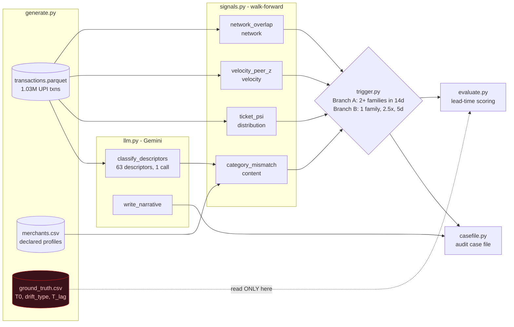

# DriftWatch

**Continuous merchant-drift detection for Indian payment aggregators.**

[](https://github.com/Nithin2511/DriftWatch-Continuous-merchant-drift-detection-for-Indian-payment-aggregators/actions/workflows/ci.yml)


> Razorpay AI Buildathon — Track 02 (AI Risk Manager)

### ▶ [Live dashboard](https://nithin2511.github.io/DriftWatch-Continuous-merchant-drift-detection-for-Indian-payment-aggregators/)

No install, no key, no backend — the deployed build carries the committed
evaluation output. Start on **Overview**, then open **Case files (23)**: it lists
every held-out trigger, including the false positives, labelled as such.

## The problem

A **payment aggregator** (PA) — Razorpay, Cashfree, PayU — onboards a merchant, verifies
who they are, and then processes their payments. Verification happens once, on day 1. The
business can change any time after that.

**Merchant drift** is that change going somewhere it should not. Three forms matter:

| Threat model | What the merchant actually starts doing |
|---|---|
| **Prohibited category** | Quietly begins selling goods the PA is not licensed to process — replica goods, unlicensed nutraceuticals, offshore wallet top-ups — while its registration still says "electronics retail" |
| **Third-party layering** | Starts processing payments for *someone else's* business through its own account, so an unvetted entity gets payment access it was never approved for |
| **Bust-out** | Ramps volume hard for weeks to build trust and float, then takes the money and disappears, leaving refunds and chargebacks behind |

A merchant clears KYC on day 1 and drifts by day 40. Two clocks are running, badly
mismatched:

| Clock | Duration |
|---|---|
| Time to investigate once a warning signal appears | **72 hours** (Mastercard SMMP, live 24 Jul 2026) |
| Time until confirming evidence arrives — chargebacks, law-enforcement account holds | **30–90 days** |

A system that waits for chargebacks cannot meet a 72-hour clock; it is structurally too
late. DriftWatch fires on **leading behavioural signals** and is graded on how many days of
warning that bought.

---

## What it does

Five components. The ML lives inside individual signals; the decision that combines them is
a rule you can read.

```
generate.py  ->  synthetic portfolio: 220 merchants, 1.03M UPI transactions,
                 44 drifters, and 17 "confounders" -- honest merchants whose
                 business genuinely changed, which SHOULD be hard to tell
                 apart from drift. Ground truth is held back.
signals.py   ->  4 independent walk-forward signal families
trigger.py   ->  explicit two-branch rule (no composite score, no black box)
casefile.py  ->  structured audit case file + generated narrative
evaluate.py  ->  dev/held-out split, lead-time and false-positive-cost reporting
```

### The four signals

Each measures a merchant against **its own declared profile and its own history**, not
against a global model of "risky".

| Signal | Family | What it measures |
|---|---|---|
| `category_mismatch` | content | Share of transactions whose item text implies a category other than the declared one |
| `ticket_psi` | distribution | **PSI** (Population Stability Index — a standard measure of how far a distribution has moved) of recent ticket sizes against this merchant's own first-30-day baseline. Above 0.25 is conventionally a significant shift |
| `velocity_peer_z` | velocity | Growth rate, **peer-relative**: scored against how every *other* merchant grew on the same day, so a market-wide surge registers as normal |
| `network_overlap` | network | How far this merchant's payer population overlaps another merchant's — **VPA** being the UPI Virtual Payment Address, the `name@bank` handle a customer pays from — plus shared settlement accounts |

### The rule that combines them

```
Branch A   >= 2 DISTINCT families cross threshold within a rolling 14-day window
Branch B   1 family at >= 2.5x threshold for 5 consecutive days
           -> weaker recommended action
```

Branch B exists because a bust-out is single-family by construction: it crosses velocity
hard and crosses nothing else, because a volume ramp is what a bust-out *is*.

### The output is a case file, not a score

A score cannot satisfy an investigation duty. The regulator asks *when did you know, what
did you look at, and on what basis did you act*. Every trigger emits this — trimmed here,
full versions land in `out/cases/`:

```jsonc
{
  "case_id": "DW-MID0019-D152",
  "subject_entity": {
    "merchant_id": "MID0019",
    "declared_category": "food_and_beverage",   // what they registered as
    "declared_avg_ticket_inr": 270.08,
    "onboarding_day": 28
  },
  "trigger_day": 152,                            // 124 days after onboarding
  "grounds_for_review": {
    "branch": "A_corroboration",
    "rule": "Branch A: >= 2 distinct signal families each crossed threshold
             within a rolling 14-day window.",
    "families_fired": ["distribution", "network"]
  },
  "signals_fired": [
    { "signal": "ticket_psi",      "value": 0.2819, "threshold": 0.25,
      "first_crossed_day": 152,
      "reading": "PSI of trailing ticket sizes vs this merchant's own 30-day
                  baseline. > 0.25 is a significant distributional shift." },
    { "signal": "network_overlap", "value": 0.35,   "threshold": 0.20,
      "first_crossed_day": 142,
      "reading": "Overlap of this merchant's payer-VPA population with another
                  merchant's, and/or a shared settlement account." }
  ],
  "supporting_data": {
    "baseline_median_ticket_inr": 267.9, "current_median_ticket_inr": 362.14,
    "ticket_shift_multiple": 1.35,
    "baseline_daily_txns": 87.6,         "current_daily_txns": 142.6
  },
  "recommended_action": "escalate - open investigation within 72 hours; ...",
  "provenance": {
    "descriptor_classifier_mode": "gemini",     // or a labelled fallback
    "narrative_mode": "gemini",
    "data": "synthetic", "generator_seed": 20260823,
    "thresholds": { "ticket_psi": 0.25, "network_overlap": 0.2 }
  },
  "narrative": "Merchant MID0019 (declared: food_and_beverage) crossed the
                corroboration threshold on day 152 ..."
}
```

Every case states the thresholds it was judged against and how it was produced, so a
reviewer can replay the decision.

---

## Headline result

**The metric is lead time bought.** For every drifting merchant the generator records
`T_lag` — the day the lagging, confirming evidence (a chargeback surge, an account hold)
*would have* arrived anyway. **Lead time = `T_lag` − the day DriftWatch fired**: the days of
warning bought over doing nothing. A detector with excellent AUC that only fires once
chargebacks are flowing bought **zero** days, and the chargebacks would have caught it
anyway.

Held-out split — 40% of merchants, scored exactly once, thresholds never tuned on it.
**This is the system's result.**

```
Median LEAD TIME BOUGHT        32.5 days    (IQR 20-40, range 4-68)
Caught before lagging evidence 14/17        82.4%   95% CI 59.0-93.8
  ... with lead > 7 days       13/17        76.5%   95% CI 52.7-90.4
False-positive rate            9/71         12.7%   95% CI  6.8-22.4
                                            (6 of the 9 are legitimate-change confounders)
```

> **"You generated the data, so of course you detected it."** The generator is built to be
> hostile, not convenient: non-drifters carry organic growth, category-specific weekday
> seasonality and a portfolio-wide festival surge, and 17 of them are **confounders** —
> merchants with genuine legitimate change, a real category pivot or a viral growth spike,
> which *should* be hard and are counted as false positives when they fire. A separability
> check run **before any detector existed** established that `prohibited_category` drift
> sits at a 1.12 volume ratio, *inside* the non-drifter range, so volume alone cannot catch
> it — and the ablation below confirms that prediction. Full treatment:
> [docs/DATA_PLAN.md](docs/DATA_PLAN.md).

**Read the intervals, not the point estimates.** With 17 held-out drifters every rate here
carries roughly a ±20-point interval. The honest claim is "this buys weeks of warning on
most drifters", not "82.4%".

| Drift type | Caught | Median lead | 95% CI |
|---|---|---|---|
| `third_party_layering` | 7/7 | 41.0 d | 64.6–100 |
| `bust_out` | 3/5 | 19.0 d | 23.1–88.2 |
| `prohibited_category` | 4/5 | 27.0 d | 37.6–96.4 |

Development split: 19/27 caught (70.4%), median lead 34.0 d, FP 8.6% (9/105). Stratified
across drift types and confounders. Held-out scores *higher* than development — that is
small-sample noise (z = 0.89), not a result.

Two of these get a named section of their own in
[docs/EVALUATION.md](docs/EVALUATION.md) rather than a footnote: the **false-positive
budget is not a guarantee** (dev 8.6% vs held-out 12.7%; the constraint bounds a point
estimate, not a population rate), and **one catch had only a 4-day lead** against a
72-hour clock, which is why the `> 7 days` row is reported alongside the median. Six
more are listed under [Honest limitations](#honest-limitations) below.

### The floor: no content signal

`category_mismatch` reads item-level descriptor text, and **a real PA often does not have
it** — a UPI record reliably carries amount, timestamp, payer VPA, PSP handle and
settlement account, but item descriptors exist only if the merchant passes them, and the
long tail does not. So the result is reported with that family removed as well:

```
STRESS TEST -- not the headline. Content family removed, fully recalibrated:
Median LEAD TIME BOUGHT        36.0 days    (IQR 22-45)
Caught before lagging evidence 9/17         52.9%   95% CI 31.0-73.8
  ... with lead > 7 days       8/17         47.1%   95% CI 26.2-69.0
False-positive rate            8/71         11.3%   95% CI  5.8-20.7
```

That is the floor this system operates at using **only signals derivable from amount,
timing and counterparty identifiers**, which every PA has for every transaction.
`third_party_layering` barely moves (7/7 to 6/7) and `bust_out` not at all (3/5 to 3/5), but
`prohibited_category` collapses from 4/5 to **0/5** — exactly as the pre-registered
separability check predicted. Reproduce with `python run_all.py --ablate-content`; full
tables in [docs/EVALUATION.md](docs/EVALUATION.md).

The median *rises* under ablation, 32.5 to 36.0 days. That is survivorship, not
improvement: the cases that still fire are the strongly corroborated ones, and those were
always the ones that fired early. Read the catch rate.

---

Descriptor classification ran on **Gemini 3.5 Flash: 63/63 correct (100%), including all
8 restricted descriptors.** The deterministic fallback lexicon scores 51/63 (81.0%) and 5/8
restricted, so the LLM is carrying real weight on the content signal rather than decorating
the pipeline.

---

## Run it

Prefer to just look at it? The dashboard is deployed at **<https://nithin2511.github.io/DriftWatch-Continuous-merchant-drift-detection-for-Indian-payment-aggregators/>**.
To run the whole thing yourself:

```bash
# 1. Pipeline & CLI Demo
pip install -r requirements.txt   # pandas, numpy, pyarrow
python run_all.py                # ~2.2 min compute + 4 API calls
python -m driftwatch.demo        # the CLI demo view
python run_all.py --ablate-content   # no-content ablation -> out-ablation/

# 2. React dashboard  (deployed copy: https://nithin2511.github.io/DriftWatch-Continuous-merchant-drift-detection-for-Indian-payment-aggregators/)
python export_frontend_data.py   # out/ -> frontend/src/data/*.js (refuses on inconsistency)
cd frontend
npm install
npm run dev                      # live dev server at http://localhost:3000
# or preview production build directly:
# python -m http.server 3000 --directory frontend/dist
```

```bash
# 3. Invariant tests
pip install pytest
python -m pytest tests -q
```

Set `GEMINI_API_KEY` to use Gemini for descriptor classification and case-file
narratives. Without a key the pipeline still runs end to end using deterministic
fallbacks, which are **labelled as such in every output** — a case file that does not
say how it was produced is not auditable.

---

## Repository layout

```
driftwatch/            the pipeline package
  generate.py          synthetic portfolio + held-back ground truth
  signals.py           4 independent walk-forward signal families
  trigger.py           the explicit two-branch rule
  casefile.py          structured audit case file + narrative
  evaluate.py          dev/held-out split, lead-time scoring   <- only reader of ground truth
  llm.py               Gemini layer, with labelled deterministic fallbacks
  demo.py              the CLI demo view
tests/                 20 invariant tests (see below)
docs/                  architecture, data plan, evaluation, panel Q&A
frontend/              React dashboard; a presentation layer over out/
run_all.py             one-command pipeline
export_frontend_data.py  out/ -> frontend data modules, refuses on inconsistency
```

### What the tests actually test

39 tests in two files. Neither checks that DriftWatch *scores well*.

**`test_invariants.py` (20)** — the properties that make the score believable, the ones a
reviewer would try to break:

- `ground_truth.csv` is unreachable from every component except `evaluate.py` (static scan)
- a portfolio-wide uniform surge produces **zero** peer-relative anomaly for everyone
- Branch A needs two distinct families; Branch B does not fire a day early
- PSI and z thresholds stay canonical constants, never portfolio quantiles
- the LLM is never asked for a verdict, and the API key never reaches stdout
- emitted case files agree with the evaluation that scored them

**`test_docs_consistency.py` (19)** — every number quoted in this README and in
`docs/EVALUATION.md` is parsed back out of the prose and asserted against
`out/evaluation.json`: catch counts and rates, median lead and IQR, false positives,
the `lead > 7 days` row, per-drift-type rows, the development split, and the narrative
provenance count. A mismatch fails with the file, the claimed value and the computed value.

The reason is specific. Every numeric inconsistency found in this project was found by
manual audit, and manual audits are correct on the day they run and stale after the next
edit. These tests make that class of error impossible rather than merely absent.

They deliberately do **not** check that the numbers are right — a miscalibrated detector
reporting itself consistently everywhere would pass. Correctness is `test_invariants.py`'s
job and the split discipline's. These check only that the repo tells one story.

---

## Architecture



<details>
<summary>Diagram source (Mermaid)</summary>

Rendered to `docs/architecture.svg` so it displays everywhere, including in viewers that
do not execute Mermaid. Source of truth is `docs/architecture.mmd`:



</details>

The dashed edge is the whole evaluation argument: `ground_truth.csv` is written by the
generator and read by `evaluate.py` alone. No signal, no trigger, and no case file can
see `T0` or `T_lag`. A test enforces this by scanning the package source.

## Three design decisions worth arguing about

**Velocity is peer-relative.** During Diwali every merchant ramps. An absolute detector
fires on the whole portfolio and gets switched off within a week. DriftWatch scores each
merchant's growth against the same-day cross-section, so a portfolio-wide surge is
invisible and a merchant ramping *against* a flat portfolio is not. This needs
portfolio-wide same-day visibility — exactly what a PA has and a merchant does not.

**The trigger is a rule, not a model.** A learned combiner would score better and be
undefensible in an audit. The ML lives inside individual signals; the combination is an
explicit corroboration rule a reviewer can read and an auditor can replay.

**The LLM synthesises, never judges.** Gemini classifies descriptors (a text task) and
writes the case narrative (a language task). It is never asked "is this merchant
fraudulent." The fire/no-fire decision is quantitative. That split is the difference
between a system and an LLM wrapper. The classifier is called once per *unique
descriptor set, not per transaction: all **63 unique descriptors across 1.03M
transactions go out in a single request**. Narratives are batched the same way — 23 case
files in 3 requests. A full run costs **4 API calls**, not 24, which is what makes it
reproducible on a free tier capped at 20 requests/day.

---

## Honest limitations

- **`descriptor` is merchant-supplied and often absent in production.** In this schema
  every transaction carries clean item text; a real UPI record guarantees only amount,
  timestamp, payer VPA, PSP handle and settlement account. The classifier's 63/63 reflects
  an authored vocabulary, not a solved problem — real descriptors are abbreviated,
  transliterated, or just an order ID. What the system does without that family is
  measured, not hand-waved: see the ablation above and
  [docs/DATA_PLAN.md](docs/DATA_PLAN.md).
- **The data is synthetic.** What is demonstrated is that the detector buys lead time
  against a stated threat model, not that it holds at these numbers on a real book. The
  generator was built to be adversarial to the detector: non-drifters carry organic
  growth, weekday seasonality, a portfolio-wide festival surge, and 17 confounders with
  genuine legitimate structural change. `prohibited_category` drift has a median volume
  ratio of 1.12 — *inside* the non-drifter range (p90 = 1.21) — so volume alone cannot
  catch it. See [docs/DATA_PLAN.md](docs/DATA_PLAN.md).
- **The committed run has 21 of 23 Gemini narratives; 2 are the deterministic template.**
  Cause is a hard free-tier ceiling — `GenerateRequestsPerDayPerProjectPerModel` is
  **20 requests/day/model**, and one-call-per-case needs 24. Narrative generation is now
  batched (23 cases → 3 requests, verified end to end), so a fresh run needs 4 calls total
  and completes cleanly; the committed artifact predates the day's quota reset. Each case
  file still states its own `provenance.narrative_mode`.
- **Stratified evaluation balance.** All 3 drift categories are balanced across dev and
  held-out splits (prohibited_category n=5 on held-out, catching 4/5 at 27.0d lead). With
  17 held-out drifters, every rate here carries a roughly ±20-point 95% interval.
- **No regulatory clause numbers are cited.** The programs and duties named were verified;
  clause-level citation was not, so it is absent rather than fabricated.
- **The false-positive rate is not operationally solved at Razorpay's scale.** See the
  third question in [docs/PANEL_QA.md](docs/PANEL_QA.md), which does not pretend otherwise.

---

## Docs

| | |
|---|---|
| [ARCHITECTURE.md](docs/ARCHITECTURE.md) | Five components, data flow, design decisions |
| [DATA_PLAN.md](docs/DATA_PLAN.md) | What the generator produces and why it is a fair test |
| [EVALUATION.md](docs/EVALUATION.md) | Walk-forward method, split discipline, results |
| [PANEL_QA.md](docs/PANEL_QA.md) | The three hardest questions, answered |
| [CUT_LIST.md](docs/CUT_LIST.md) | What was cut and why |
| [DEMO_SCRIPT.md](docs/DEMO_SCRIPT.md) | 5-minute pitch sequence |

Defense-only. The generator produces behavioural *consequences* of drift. There is no
evasion logic, no threshold-probing, and deliberately no "can I beat my own detector" mode.
